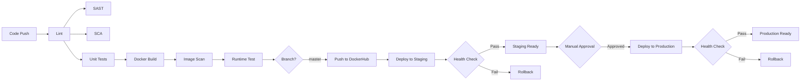

# DevOps CI/CD Project - FastAPI Application

[](https://github.com/ayaankhan28/devops-project/actions/workflows/ci.yml)
[](https://github.com/ayaankhan28/devops-project/actions/workflows/cd-staging.yml)

A production-grade CI/CD pipeline implementation for a FastAPI application, demonstrating DevOps and DevSecOps best practices using GitHub Actions.

## 📋 Project Overview

This project implements a **secure and automated CI/CD pipeline** that:
- Automatically builds and tests the application on every code change
- Enforces coding standards and quality gates
- Detects security vulnerabilities early (shift-left security)
- Ensures container images are safe and runnable
- Deploys to staging and production environments with health checks
- Implements automatic rollback on deployment failures

## 🏗️ Architecture

### Application Stack
- **Framework**: FastAPI 0.109.0
- **Runtime**: Python 3.11
- **Server**: Uvicorn (ASGI)
- **Containerization**: Docker (multi-stage build)
- **Testing**: pytest with coverage

### CI/CD Pipeline Stages

#### Continuous Integration (CI)
1. **Code Checkout** - Retrieve source code
2. **Linting** - Enforce coding standards with flake8
3. **SAST** - Static Application Security Testing with CodeQL
4. **SCA** - Software Composition Analysis with pip-audit
5. **Unit Testing** - Run pytest with coverage reporting
6. **Docker Build** - Build container image with caching
7. **Image Scan** - Container vulnerability scanning with Trivy
8. **Runtime Test** - Validate container runs correctly
9. **DockerHub Push** - Push trusted images (master branch only)

#### Continuous Deployment (CD)
1. **Staging Deployment** - Automatic deployment after successful CI
   - Health checks with retry logic
   - Smoke tests for critical endpoints
   - Automatic rollback on failure
   
2. **Production Deployment** - Manual approval required
   - Backup of current container before deployment
   - Comprehensive health and performance checks
   - Automatic rollback mechanism
   - Cleanup of old backups

## 🚀 Quick Start

### Prerequisites
- Python 3.11+
- Docker
- Git

### Local Development

1. **Clone the repository**
   ```bash
   git clone https://github.com/ayaankhan28/devops-project.git
   cd devops-project
   ```

2. **Create virtual environment**
   ```bash
   python -m venv venv
   source venv/bin/activate  # On Windows: venv\Scripts\activate
   ```

3. **Install dependencies**
   ```bash
   pip install -r requirements.txt -r requirements-dev.txt
   ```

4. **Run the application**
   ```bash
   uvicorn app:app --reload
   ```

5. **Access the application**
   - API: http://localhost:8000
   - Health Check: http://localhost:8000/health
   - API Documentation: http://localhost:8000/docs

### Running Tests

```bash
# Run all tests with coverage
pytest --cov=. --cov-report=html

# Run linting
flake8 .

# Run security scans
pip-audit --requirement requirements.txt
```

### Docker Deployment

```bash
# Build the image
docker build -t devops-fastapi:latest .

# Run the container
docker run -d -p 8000:8000 --name devops-fastapi devops-fastapi:latest

# Check health
curl http://localhost:8000/health

# View logs
docker logs devops-fastapi

# Stop and remove
docker stop devops-fastapi && docker rm devops-fastapi
```

### Using Docker Compose

```bash
# Start the application
docker-compose up -d

# View logs
docker-compose logs -f

# Stop the application
docker-compose down
```

## 🔐 Security Features

### DevSecOps Integration

1. **Static Application Security Testing (SAST)**
   - Tool: CodeQL
   - Detects: OWASP Top 10 vulnerabilities, code-level security issues
   - Integration: GitHub Security tab

2. **Software Composition Analysis (SCA)**
   - Tool: pip-audit
   - Detects: Vulnerable dependencies, supply chain risks
   - Runs: On every CI build

3. **Container Image Scanning**
   - Tool: Trivy
   - Detects: OS and library vulnerabilities in Docker images
   - Severity: CRITICAL and HIGH
   - Integration: GitHub Security tab

### Secrets Management

All sensitive credentials are managed using **GitHub Secrets**:

| Secret Name | Description |
|-------------|-------------|
| `DOCKERHUB_USERNAME` | DockerHub username |
| `DOCKERHUB_TOKEN` | DockerHub access token (not password) |

**⚠️ Never hardcode credentials in your code or configuration files!**

## 📊 CI/CD Pipeline Details

### Why Each Stage Exists

| Stage | Purpose | Risk Mitigation |
|-------|---------|-----------------|
| **Linting** | Enforces coding standards | Prevents technical debt and maintainability issues |
| **SAST (CodeQL)** | Detects security vulnerabilities in code | Prevents OWASP Top 10 issues from reaching production |
| **SCA (pip-audit)** | Scans dependencies for vulnerabilities | Identifies supply-chain security risks |
| **Unit Tests** | Validates business logic | Prevents regressions and ensures code correctness |
| **Docker Build** | Creates consistent container images | Ensures reproducible deployments |
| **Image Scan (Trivy)** | Scans container for vulnerabilities | Prevents vulnerable images from being deployed |
| **Runtime Test** | Validates container behavior | Ensures the application runs correctly in containerized environment |
| **DockerHub Push** | Publishes trusted images | Enables downstream deployment processes |
| **Staging Deployment** | Tests in staging environment | Validates deployment process before production |
| **Production Deployment** | Deploys to production | Delivers features to end users with safety gates |

### Pipeline Flow



## 🔧 Configuration

### GitHub Actions Setup

1. **Enable GitHub Actions**
   - Go to repository Settings → Actions → General
   - Enable "Allow all actions and reusable workflows"

2. **Configure Secrets**
   - Go to repository Settings → Secrets and variables → Actions
   - Add the following secrets:
     - `DOCKERHUB_USERNAME`: Your DockerHub username
     - `DOCKERHUB_TOKEN`: DockerHub access token (create at https://hub.docker.com/settings/security)

3. **Enable Security Features**
   - Go to repository Settings → Security → Code security and analysis
   - Enable "Dependency graph"
   - Enable "Dependabot alerts"
   - Enable "Dependabot security updates"

### DockerHub Setup

1. Create a DockerHub account at https://hub.docker.com
2. Create an access token:
   - Go to Account Settings → Security → New Access Token
   - Name: "GitHub Actions"
   - Permissions: Read, Write, Delete
   - Copy the token and save it as `DOCKERHUB_TOKEN` in GitHub Secrets

## 📈 Monitoring and Observability

### Health Checks
- **Endpoint**: `/health`
- **Response**: `{"status": "healthy", "service": "devops-fastapi", "version": "1.0.0"}`
- **Frequency**: Every 30 seconds (Docker health check)

### Logs
```bash
# View application logs
docker logs devops-fastapi-production

# Follow logs in real-time
docker logs -f devops-fastapi-production

# View last 100 lines
docker logs --tail 100 devops-fastapi-production
```

## 🚢 Deployment

### Staging Deployment
Automatically triggered after successful CI on master branch.

```bash
# Manual trigger
gh workflow run cd-staging.yml
```

### Production Deployment
Requires manual approval via GitHub Actions UI.

```bash
# Trigger production deployment
gh workflow run cd-production.yml -f version=latest
```

### Using Deployment Scripts

```bash
# Deploy to staging
./scripts/deploy.sh staging latest

# Deploy to production
./scripts/deploy.sh production latest

# Run health check
./scripts/health-check.sh 8000
```

## 📚 API Documentation

### Available Endpoints

| Method | Endpoint | Description |
|--------|----------|-------------|
| GET | `/` | Root endpoint with API information |
| GET | `/health` | Health check endpoint |
| GET | `/items` | Get all items |
| GET | `/items/{item_id}` | Get specific item |
| POST | `/items` | Create new item |
| PUT | `/items/{item_id}` | Update existing item |
| DELETE | `/items/{item_id}` | Delete item |
| GET | `/docs` | Interactive API documentation (Swagger UI) |
| GET | `/redoc` | Alternative API documentation (ReDoc) |

### Example Requests

```bash
# Health check
curl http://localhost:8000/health

# Get all items
curl http://localhost:8000/items

# Get specific item
curl http://localhost:8000/items/1

# Create new item
curl -X POST http://localhost:8000/items \
  -H "Content-Type: application/json" \
  -d '{"name": "New Item", "price": 99.99, "in_stock": true}'

# Update item
curl -X PUT http://localhost:8000/items/1 \
  -H "Content-Type: application/json" \
  -d '{"name": "Updated Item", "price": 149.99, "in_stock": false}'

# Delete item
curl -X DELETE http://localhost:8000/items/1
```

## 🧪 Testing

### Test Coverage
- **Target**: 80% minimum coverage
- **Current**: View coverage report at `htmlcov/index.html` after running tests

### Test Categories
1. **Unit Tests**: Test individual functions and endpoints
2. **Integration Tests**: Test API endpoints end-to-end
3. **Smoke Tests**: Basic functionality tests in deployment pipelines

## 📝 Project Structure

```
devops-project/
├── .github/
│   ├── workflows/
│   │   ├── ci.yml                 # CI pipeline
│   │   ├── cd-staging.yml         # Staging deployment
│   │   └── cd-production.yml      # Production deployment
│   └── dependabot.yml             # Dependency updates
├── scripts/
│   ├── deploy.sh                  # Deployment script
│   └── health-check.sh            # Health check script
├── tests/
│   ├── __init__.py
│   ├── conftest.py                # Pytest configuration
│   └── test_app.py                # Test suite
├── docs/
│   ├── ARCHITECTURE.md            # Architecture documentation
│   └── PROJECT_REPORT.md          # Final project report
├── app.py                         # FastAPI application
├── Dockerfile                     # Multi-stage Docker build
├── docker-compose.yml             # Docker Compose configuration
├── requirements.txt               # Production dependencies
├── requirements-dev.txt           # Development dependencies
├── pytest.ini                     # Pytest configuration
├── .flake8                        # Flake8 configuration
├── .dockerignore                  # Docker ignore patterns
├── .gitignore                     # Git ignore patterns
└── README.md                      # This file
```

## 🎯 Learning Outcomes

This project demonstrates:
1. **CI/CD Pipeline Design**: Understanding of pipeline stages and their purpose
2. **DevSecOps**: Integration of security scanning at multiple stages
3. **Containerization**: Docker best practices and multi-stage builds
4. **Automation**: Automated testing, building, and deployment
5. **Quality Gates**: Enforcing code quality and security standards
6. **Deployment Strategies**: Staging, production, and rollback mechanisms
7. **Infrastructure as Code**: Declarative pipeline definitions
8. **Monitoring**: Health checks and observability

## 🔄 Continuous Improvement

### Automated Dependency Updates
- **Tool**: Dependabot
- **Frequency**: Weekly
- **Scope**: Python packages, GitHub Actions, Docker base images

### Future Enhancements
- [ ] Add integration tests
- [ ] Implement blue-green deployment
- [ ] Add performance testing
- [ ] Integrate with cloud platforms (AWS/GCP/Azure)
- [ ] Add monitoring and alerting (Prometheus/Grafana)
- [ ] Implement canary deployments
- [ ] Add database integration
- [ ] Implement API rate limiting

## 📄 License

MIT License - see LICENSE file for details

## 👤 Author

**Ayaan Khan**
- Scaler Student ID: 10029
- GitHub: [@ayaankhan28](https://github.com/ayaankhan28)
- Repository: [devops-project](https://github.com/ayaankhan28/devops-project)

## 🙏 Acknowledgments

- FastAPI framework and documentation
- GitHub Actions community
- Docker and containerization best practices
- DevSecOps community and tools

---

**Note**: This project is part of the Advanced DevOps CI/CD assessment and demonstrates practical understanding of modern DevOps practices, automation, and security integration.
