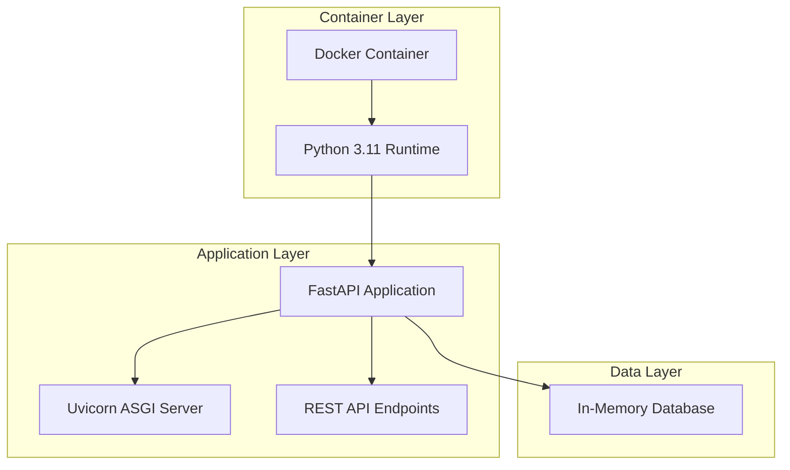
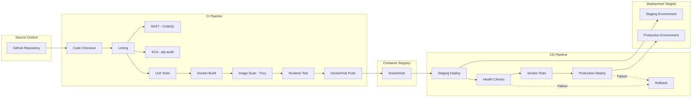
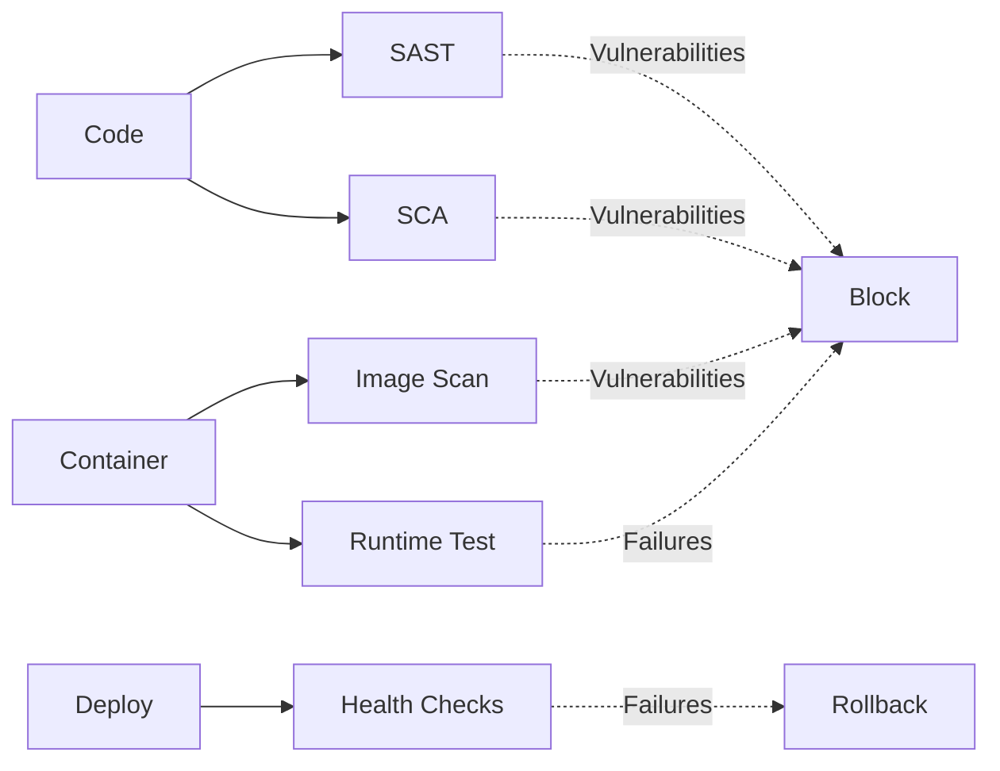
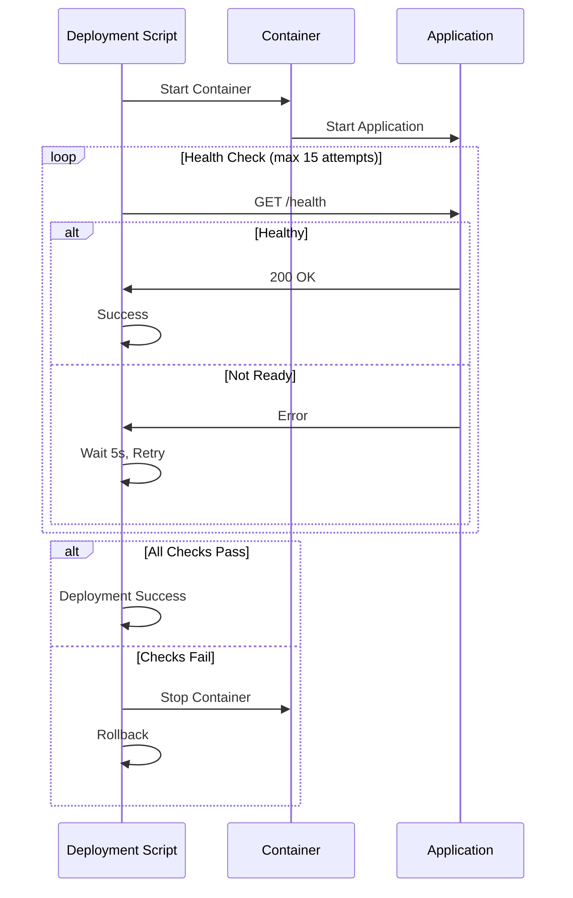

# CI/CD Architecture

## Overview

This document describes the architecture and design of the CI/CD pipeline for the DevOps FastAPI project.

## System Architecture

### Application Architecture



### CI/CD Pipeline Architecture



## CI Pipeline Stages

### Stage 1: Code Quality & Linting

**Tool**: flake8

**Purpose**: Enforce Python coding standards (PEP 8)

**Configuration**:
- Max line length: 88 characters (Black compatible)
- Excludes: `.git`, `__pycache__`, `.pytest_cache`, `venv`

**Why It Matters**:
- Prevents technical debt
- Ensures code maintainability
- Catches common programming errors early
- Enforces consistent code style across the team

### Stage 2: SAST - Static Application Security Testing

**Tool**: CodeQL

**Purpose**: Detect security vulnerabilities in source code

**Configuration**:
- Language: Python
- Queries: security-and-quality

**Security Issues Detected**:
- SQL injection vulnerabilities
- Cross-site scripting (XSS)
- Command injection
- Path traversal
- Insecure deserialization
- Hardcoded credentials
- OWASP Top 10 vulnerabilities

**Integration**: Results appear in GitHub Security tab

### Stage 3: SCA - Software Composition Analysis

**Tool**: pip-audit

**Purpose**: Identify vulnerable dependencies

**What It Scans**:
- Direct dependencies in `requirements.txt`
- Transitive dependencies
- Known CVEs in Python packages

**Why It Matters**:
- Prevents supply chain attacks
- Identifies vulnerable third-party libraries
- Ensures compliance with security policies
- Reduces risk of exploitable dependencies

### Stage 4: Unit Testing

**Tool**: pytest with coverage

**Configuration**:
- Minimum coverage: 80%
- Coverage report: HTML and terminal
- Async test support enabled

**Test Categories**:
1. Endpoint tests (GET, POST, PUT, DELETE)
2. Error handling tests (404, 422)
3. Data validation tests
4. Edge case tests
5. Integration tests

**Metrics Tracked**:
- Test pass rate
- Code coverage percentage
- Test execution time

### Stage 5: Docker Build

**Strategy**: Multi-stage build

**Stage 1 - Builder**:
- Base image: `python:3.11-slim`
- Install build dependencies
- Install Python packages
- Optimize for build speed

**Stage 2 - Production**:
- Base image: `python:3.11-slim`
- Copy only necessary artifacts
- Run as non-root user (security)
- Minimal attack surface

**Optimizations**:
- Layer caching with GitHub Actions cache
- `.dockerignore` to reduce context size
- Multi-stage build to reduce final image size

### Stage 6: Container Image Scanning

**Tool**: Trivy

**Scan Types**:
1. **OS Package Vulnerabilities**: Scans base image packages
2. **Application Dependencies**: Scans Python packages
3. **Configuration Issues**: Detects misconfigurations

**Severity Levels**:
- CRITICAL: Must fix before deployment
- HIGH: Should fix before deployment
- MEDIUM: Fix in next iteration
- LOW: Fix when convenient

**Integration**: Results uploaded to GitHub Security tab (SARIF format)

### Stage 7: Runtime Container Testing

**Purpose**: Validate container runs correctly

**Tests Performed**:
1. Container starts successfully
2. Health endpoint responds (200 OK)
3. Items endpoint responds (200 OK)
4. Application logs show no errors

**Why It Matters**:
- Catches runtime issues not visible in build
- Validates environment configuration
- Ensures container networking works
- Verifies application startup sequence

### Stage 8: DockerHub Push

**Trigger**: Only on `master` or `main` branch

**Tags Created**:
1. `latest` - Always points to most recent build
2. `<commit-sha>` - Specific version for rollback

**Why Multiple Tags**:
- `latest` for easy deployment
- Commit SHA for version tracking and rollback
- Enables reproducible deployments

## CD Pipeline Stages

### Staging Deployment

**Trigger**: Automatic after successful CI

**Process**:
1. Pull latest Docker image from DockerHub
2. Stop existing staging container
3. Start new container on port 8001
4. Wait for application startup (15 seconds)
5. Run health checks with retry logic
6. Run smoke tests on critical endpoints
7. Rollback on any failure

**Health Check Strategy**:
- Max attempts: 10
- Retry interval: 5 seconds
- Endpoints tested: `/health`, `/items`, `/`

**Rollback Trigger**:
- Health check failure
- Smoke test failure
- Container startup failure

### Production Deployment

**Trigger**: Manual approval via `workflow_dispatch`

**Process**:
1. Backup current production container
2. Pull specified Docker image version
3. Stop existing production container
4. Start new container on port 8000
5. Wait for application startup (15 seconds)
6. Run comprehensive health checks
7. Run production smoke tests
8. Perform performance checks
9. Rollback on any failure
10. Cleanup old backups (keep last 3)

**Safety Features**:
- Manual approval required
- Backup before deployment
- Automatic rollback on failure
- Performance validation
- Deployment notifications

**Rollback Strategy**:
1. Stop failed container
2. Find most recent backup
3. Start backup container
4. Verify rollback success
5. Alert on rollback failure

## Security Architecture

### Shift-Left Security

Security is integrated at every stage of the pipeline:



### Security Layers

1. **Code Level**: CodeQL SAST
2. **Dependency Level**: pip-audit SCA
3. **Container Level**: Trivy image scanning
4. **Runtime Level**: Container testing
5. **Deployment Level**: Health checks and rollback

### Secrets Management

**GitHub Secrets**:
- `DOCKERHUB_USERNAME`: DockerHub username
- `DOCKERHUB_TOKEN`: DockerHub access token

**Best Practices**:
- Never hardcode credentials
- Use GitHub Secrets for sensitive data
- Rotate tokens regularly
- Use minimal permissions (principle of least privilege)

## Deployment Architecture

### Environment Strategy

| Environment | Purpose | Port | Trigger |
|-------------|---------|------|---------|
| **Staging** | Pre-production testing | 8001 | Automatic after CI |
| **Production** | Live application | 8000 | Manual approval |

### Container Orchestration

**Current**: Docker Compose (single host)

**Future Options**:
- Kubernetes (multi-host, auto-scaling)
- AWS ECS (managed containers)
- Docker Swarm (simple orchestration)

### Health Check Architecture



## Monitoring and Observability

### Health Monitoring

**Docker Health Check**:
- Interval: 30 seconds
- Timeout: 10 seconds
- Retries: 3
- Start period: 5 seconds

**Endpoint**: `GET /health`

**Response**:
```json
{
  "status": "healthy",
  "service": "devops-fastapi",
  "version": "1.0.0"
}
```

### Logging

**Application Logs**:
- Level: INFO
- Format: Structured logging
- Output: stdout (captured by Docker)

**Access Logs**:
- Uvicorn access logs
- HTTP method, path, status code
- Response time

## Performance Considerations

### Build Optimization

1. **Layer Caching**: GitHub Actions cache for Docker layers
2. **Dependency Caching**: pip cache for faster installs
3. **Multi-stage Build**: Smaller final images
4. **Parallel Jobs**: Independent CI stages run in parallel

### Deployment Optimization

1. **Health Check Retry**: Prevents false negatives
2. **Graceful Shutdown**: Proper signal handling
3. **Rolling Updates**: Zero-downtime deployments (future)
4. **Resource Limits**: Prevent resource exhaustion

## Failure Handling

### CI Failures

| Failure Type | Action | Notification |
|--------------|--------|--------------|
| Linting | Block merge | GitHub PR comment |
| SAST | Block merge | GitHub Security tab |
| SCA | Block merge | GitHub Security tab |
| Tests | Block merge | GitHub PR status |
| Build | Block merge | GitHub Actions log |
| Image Scan | Block merge | GitHub Security tab |
| Runtime Test | Block merge | GitHub Actions log |

### CD Failures

| Failure Type | Action | Recovery |
|--------------|--------|----------|
| Pull Image | Abort | Manual retry |
| Container Start | Rollback | Previous version |
| Health Check | Rollback | Previous version |
| Smoke Tests | Rollback | Previous version |

## Future Enhancements

### Short Term
- [ ] Add integration tests
- [ ] Implement blue-green deployment
- [ ] Add performance testing (load tests)
- [ ] Integrate with Slack/email notifications

### Medium Term
- [ ] Deploy to cloud platforms (AWS/GCP/Azure)
- [ ] Add monitoring (Prometheus/Grafana)
- [ ] Implement canary deployments
- [ ] Add database integration

### Long Term
- [ ] Multi-region deployment
- [ ] Auto-scaling based on metrics
- [ ] Advanced observability (distributed tracing)
- [ ] Chaos engineering tests

## Conclusion

This CI/CD architecture demonstrates:
- **Automation**: Fully automated build, test, and deployment
- **Security**: Multiple security scanning layers (shift-left)
- **Reliability**: Health checks and automatic rollback
- **Quality**: Enforced coding standards and test coverage
- **Observability**: Comprehensive logging and monitoring
- **Scalability**: Containerized architecture ready for orchestration

The pipeline is designed to be **production-ready**, **secure**, and **maintainable**, following DevOps and DevSecOps best practices.
