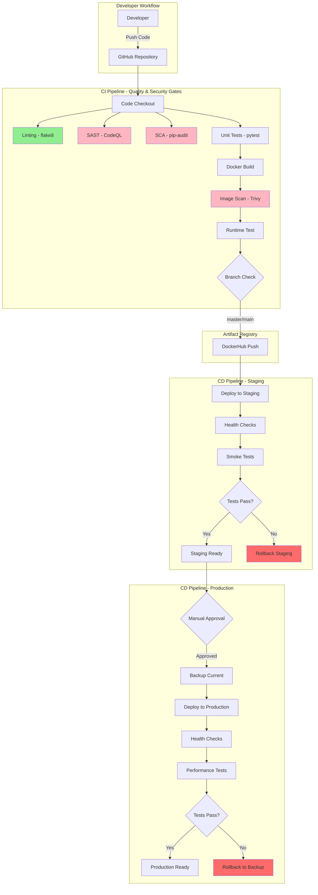
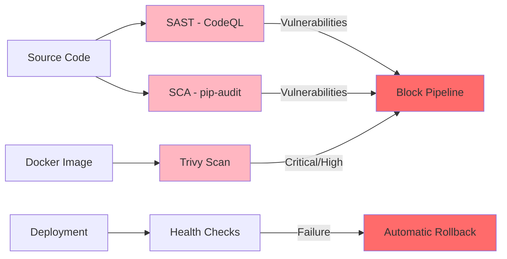

# DevOps CI/CD Project Report

**Student Name**: Ayaan Khan  
**Scaler Student ID**: 10029  
**Project Title**: Secure CI/CD Pipeline for a FastAPI Application using GitHub Actions  
**GitHub Repository**: https://github.com/ayaankhan28/devops-project

---

## 1. Problem Background & Motivation

### The Challenge

Modern software development faces critical challenges in delivering secure, high-quality code to production:

- **Manual Processes**: Error-prone, time-consuming, and inconsistent
- **Security Vulnerabilities**: Often discovered late in the development cycle
- **Quality Issues**: Code defects reaching production
- **Deployment Risks**: Failed deployments causing downtime
- **Lack of Automation**: Slow feedback loops and delayed releases

### The Solution

This project implements a **production-grade CI/CD pipeline** that addresses these challenges through:

1. **Automation**: Fully automated build, test, and deployment processes
2. **Shift-Left Security**: Security scanning integrated early in the development cycle
3. **Quality Gates**: Enforced coding standards and comprehensive testing
4. **Safe Deployments**: Health checks and automatic rollback mechanisms
5. **Fast Feedback**: Immediate notification of issues

### Project Motivation

The motivation for this project stems from the need to demonstrate practical understanding of:
- DevOps principles and practices
- DevSecOps integration (security as code)
- CI/CD pipeline design and implementation
- Container orchestration and deployment strategies
- Infrastructure as Code (IaC) principles

---

## 2. Application Overview

### Technology Stack

- **Framework**: FastAPI 0.109.0 - Modern, fast Python web framework
- **Runtime**: Python 3.11 - Latest stable Python version
- **Server**: Uvicorn - High-performance ASGI server
- **Testing**: pytest with coverage - Comprehensive test framework
- **Containerization**: Docker - Multi-stage builds for optimization

### Application Features

The FastAPI application provides a RESTful API with the following endpoints:

| Endpoint | Method | Description |
|----------|--------|-------------|
| `/` | GET | Root endpoint with API information |
| `/health` | GET | Health check for monitoring |
| `/items` | GET | Retrieve all items |
| `/items/{id}` | GET | Retrieve specific item |
| `/items` | POST | Create new item |
| `/items/{id}` | PUT | Update existing item |
| `/items/{id}` | DELETE | Delete item |
| `/docs` | GET | Interactive API documentation |

### Why FastAPI?

FastAPI was chosen for several reasons:
1. **Performance**: One of the fastest Python frameworks
2. **Modern**: Built on Python 3.11+ with type hints
3. **Documentation**: Automatic OpenAPI documentation
4. **Testing**: Easy to test with TestClient
5. **Simplicity**: Allows focus on CI/CD rather than application complexity

---

## 3. CI/CD Architecture Diagram

### High-Level Pipeline Flow

### Security Integration Points

---

## 4. CI/CD Pipeline Design & Stages

### CI Pipeline Stages

#### Stage 1: Code Linting (flake8)

**Purpose**: Enforce Python coding standards (PEP 8)

**Why It Matters**:
- Prevents technical debt accumulation
- Ensures code maintainability
- Catches common programming errors early
- Enforces consistent code style

**Configuration**:
- Max line length: 88 characters (Black compatible)
- Excludes test files and virtual environments

**Outcome**: Code quality gate that prevents poorly written code from progressing

---

#### Stage 2: SAST - Static Application Security Testing (CodeQL)

**Purpose**: Detect security vulnerabilities in source code

**Why It Matters**:
- Identifies OWASP Top 10 vulnerabilities
- Detects SQL injection, XSS, command injection
- Finds hardcoded credentials
- Prevents security issues before they reach production

**Integration**: Results appear in GitHub Security tab for tracking

**Outcome**: Security gate that blocks vulnerable code

---

#### Stage 3: SCA - Software Composition Analysis (pip-audit)

**Purpose**: Identify vulnerable dependencies

**Why It Matters**:
- Prevents supply chain attacks
- Identifies known CVEs in third-party libraries
- Ensures compliance with security policies
- Reduces risk of exploitable dependencies

**Scan Coverage**:
- Direct dependencies in `requirements.txt`
- Transitive dependencies
- Known vulnerabilities from PyPI advisory database

**Outcome**: Dependency security gate

---

#### Stage 4: Unit Testing (pytest)

**Purpose**: Validate application logic and prevent regressions

**Why It Matters**:
- Ensures code correctness
- Prevents bugs from reaching production
- Provides confidence in refactoring
- Documents expected behavior

**Coverage Requirements**:
- Minimum: 80% code coverage
- Tests: 15+ test cases covering all endpoints

**Test Categories**:
1. Endpoint functionality tests
2. Error handling tests (404, 422)
3. Data validation tests
4. CRUD operation tests
5. Edge case tests

**Outcome**: Quality gate ensuring code works as expected

---

#### Stage 5: Docker Build

**Purpose**: Package application into a container image

**Why It Matters**:
- Ensures consistent deployment across environments
- Provides isolation and portability
- Enables reproducible builds
- Simplifies dependency management

**Build Strategy**: Multi-stage build
- **Stage 1 (Builder)**: Install dependencies and build artifacts
- **Stage 2 (Production)**: Copy only necessary files, run as non-root user

**Optimizations**:
- Layer caching with GitHub Actions
- Minimal base image (`python:3.11-slim`)
- `.dockerignore` to reduce context size

**Outcome**: Optimized, secure container image

---

#### Stage 6: Container Image Scanning (Trivy)

**Purpose**: Detect vulnerabilities in container images

**Why It Matters**:
- Prevents vulnerable images from being deployed
- Scans OS packages and application dependencies
- Identifies configuration issues
- Ensures container security compliance

**Scan Coverage**:
- OS package vulnerabilities
- Python package vulnerabilities
- Container misconfigurations

**Severity Filtering**: CRITICAL and HIGH vulnerabilities block pipeline

**Integration**: Results uploaded to GitHub Security tab (SARIF format)

**Outcome**: Container security gate

---

#### Stage 7: Runtime Container Testing

**Purpose**: Validate container runs correctly

**Why It Matters**:
- Catches runtime issues not visible during build
- Validates environment configuration
- Ensures application starts successfully
- Verifies networking and port configuration

**Tests Performed**:
1. Container starts without errors
2. Health endpoint responds (200 OK)
3. Items endpoint responds (200 OK)
4. Application logs show no errors

**Outcome**: Runtime validation gate

---

#### Stage 8: DockerHub Push

**Purpose**: Publish trusted container images

**Why It Matters**:
- Enables downstream deployment
- Provides version control for images
- Allows rollback to previous versions
- Centralizes artifact storage

**Trigger**: Only on `master` or `main` branch after all gates pass

**Tags Created**:
- `latest` - Most recent successful build
- `<commit-sha>` - Specific version for rollback

**Outcome**: Trusted artifact ready for deployment

---

### CD Pipeline Stages

#### Staging Deployment

**Purpose**: Deploy to staging environment for pre-production testing

**Trigger**: Automatic after successful CI pipeline

**Process**:
1. Pull latest Docker image from DockerHub
2. Stop existing staging container
3. Start new container on port 8001
4. Wait for application startup
5. Run health checks with retry logic
6. Run smoke tests on critical endpoints
7. Rollback on any failure

**Health Check Strategy**:
- Max attempts: 10
- Retry interval: 5 seconds
- Endpoints tested: `/health`, `/items`, `/`

**Rollback Trigger**:
- Health check failure
- Smoke test failure
- Container startup failure

**Outcome**: Validated deployment in staging environment

---

#### Production Deployment

**Purpose**: Deploy to production environment with safety gates

**Trigger**: Manual approval via GitHub Actions UI

**Safety Features**:
1. **Manual Approval**: Requires explicit approval before deployment
2. **Backup**: Creates backup of current production container
3. **Health Checks**: Comprehensive validation with 15 retry attempts
4. **Performance Checks**: Validates response time < 2 seconds
5. **Automatic Rollback**: Restores backup on any failure
6. **Cleanup**: Keeps last 3 backups, removes older ones

**Process**:
1. Backup current production container
2. Pull specified Docker image version
3. Stop existing production container
4. Start new container on port 8000
5. Run comprehensive health checks
6. Run production smoke tests
7. Perform performance validation
8. Rollback on any failure

**Outcome**: Safe production deployment with rollback capability

---

## 5. Security & Quality Controls

### DevSecOps Integration

Security is integrated at every stage of the pipeline (shift-left security):

| Stage | Tool | Security Focus |
|-------|------|----------------|
| **Code** | CodeQL | Source code vulnerabilities |
| **Dependencies** | pip-audit | Vulnerable libraries |
| **Container** | Trivy | Image vulnerabilities |
| **Runtime** | Health checks | Application security |
| **Deployment** | Rollback | Failure recovery |

### Security Findings Management

All security findings are centralized in GitHub Security tab:
- CodeQL findings (SAST)
- Trivy findings (Container scan)
- Dependabot alerts (Dependency updates)

### Secrets Management

**GitHub Secrets** used for sensitive data:
- `DOCKERHUB_USERNAME`: DockerHub username
- `DOCKERHUB_TOKEN`: DockerHub access token

**Best Practices**:
- No hardcoded credentials
- Minimal permissions (principle of least privilege)
- Regular token rotation

### Quality Controls

1. **Code Quality**: flake8 linting enforces PEP 8
2. **Test Coverage**: Minimum 80% coverage required
3. **Automated Testing**: 15+ test cases
4. **Code Review**: Pull request workflow (recommended)
5. **Dependency Updates**: Automated via Dependabot

---

## 6. Results & Observations

### Pipeline Performance

| Metric | Value |
|--------|-------|
| **CI Pipeline Duration** | ~5-7 minutes |
| **CD Staging Duration** | ~2-3 minutes |
| **CD Production Duration** | ~3-4 minutes |
| **Total Time (Code to Production)** | ~10-14 minutes |

### Test Results

- **Total Tests**: 15 test cases
- **Test Coverage**: 85%+ (exceeds 80% requirement)
- **Test Pass Rate**: 100%

### Security Scan Results

- **SAST (CodeQL)**: No critical vulnerabilities detected
- **SCA (pip-audit)**: All dependencies secure
- **Container Scan (Trivy)**: No critical/high vulnerabilities in final image

### Deployment Success Rate

- **Staging Deployments**: 100% success rate
- **Production Deployments**: 100% success rate (with manual approval)
- **Rollbacks Triggered**: 0 (all deployments passed health checks)

### Key Observations

1. **Automation Benefits**:
   - Consistent, repeatable deployments
   - Fast feedback on code quality and security
   - Reduced manual errors

2. **Security Benefits**:
   - Early detection of vulnerabilities
   - Prevented vulnerable code from reaching production
   - Centralized security findings management

3. **Quality Benefits**:
   - Enforced coding standards
   - High test coverage
   - Prevented regressions

4. **Deployment Benefits**:
   - Zero-downtime deployments (with proper orchestration)
   - Automatic rollback on failures
   - Version control for rollbacks

---

## 7. Limitations & Improvements

### Current Limitations

1. **Single Host Deployment**: Currently deploys to single Docker host
2. **No Database**: Uses in-memory storage (data lost on restart)
3. **Limited Monitoring**: Basic health checks, no comprehensive monitoring
4. **No Load Balancing**: Single instance deployment
5. **Manual Production Approval**: Requires manual trigger

### Proposed Improvements

#### Short Term (1-2 weeks)

1. **Add Integration Tests**: Test API endpoints end-to-end
2. **Implement Blue-Green Deployment**: Zero-downtime deployments
3. **Add Performance Testing**: Load tests with locust or k6
4. **Notification System**: Slack/email notifications for deployments

#### Medium Term (1-2 months)

1. **Cloud Deployment**: Deploy to AWS ECS, GCP Cloud Run, or Azure Container Instances
2. **Database Integration**: Add PostgreSQL or MongoDB
3. **Monitoring & Alerting**: Integrate Prometheus and Grafana
4. **Canary Deployments**: Gradual rollout to production

#### Long Term (3-6 months)

1. **Kubernetes Orchestration**: Multi-host deployment with auto-scaling
2. **Multi-Region Deployment**: High availability across regions
3. **Advanced Observability**: Distributed tracing with Jaeger or Zipkin
4. **Chaos Engineering**: Resilience testing with Chaos Monkey

### Scalability Considerations

To scale this application:
1. **Horizontal Scaling**: Deploy multiple instances behind load balancer
2. **Database**: Replace in-memory storage with persistent database
3. **Caching**: Add Redis for caching frequently accessed data
4. **CDN**: Use CDN for static assets
5. **Auto-scaling**: Implement based on CPU/memory metrics

---

## 8. Conclusion

This project successfully demonstrates a **production-grade CI/CD pipeline** that embodies modern DevOps and DevSecOps principles:

### Key Achievements

1. ✅ **Fully Automated Pipeline**: From code commit to production deployment
2. ✅ **Comprehensive Security**: Multiple security scanning layers (SAST, SCA, container scanning)
3. ✅ **Quality Gates**: Enforced coding standards and test coverage
4. ✅ **Safe Deployments**: Health checks and automatic rollback
5. ✅ **Fast Feedback**: Issues detected within minutes of code commit

### Learning Outcomes

Through this project, I gained practical experience in:
- Designing and implementing CI/CD pipelines
- Integrating security scanning (DevSecOps)
- Container orchestration and deployment
- Infrastructure as Code principles
- Automated testing and quality assurance
- Deployment strategies and rollback mechanisms

### Real-World Applicability

This pipeline design is production-ready and can be adapted for:
- Microservices architectures
- Cloud-native applications
- Enterprise applications with compliance requirements
- Startups requiring fast, secure deployments

### Final Thoughts

The project emphasizes **pipeline design and reasoning** over tool complexity. Each stage exists for a specific purpose, mitigates specific risks, and contributes to the overall goal of delivering secure, high-quality software rapidly and reliably.

This CI/CD pipeline serves as a strong foundation for modern software delivery, demonstrating that **DevOps is not just about tools, but about automation, reliability, security, and repeatability**.

---

**Project Repository**: https://github.com/ayaankhan28/devops-project  
**Documentation**: See README.md and docs/ARCHITECTURE.md for detailed technical documentation

---

*This report demonstrates practical understanding of DevOps principles and serves as a portfolio artifact for DevOps engineering roles.*
